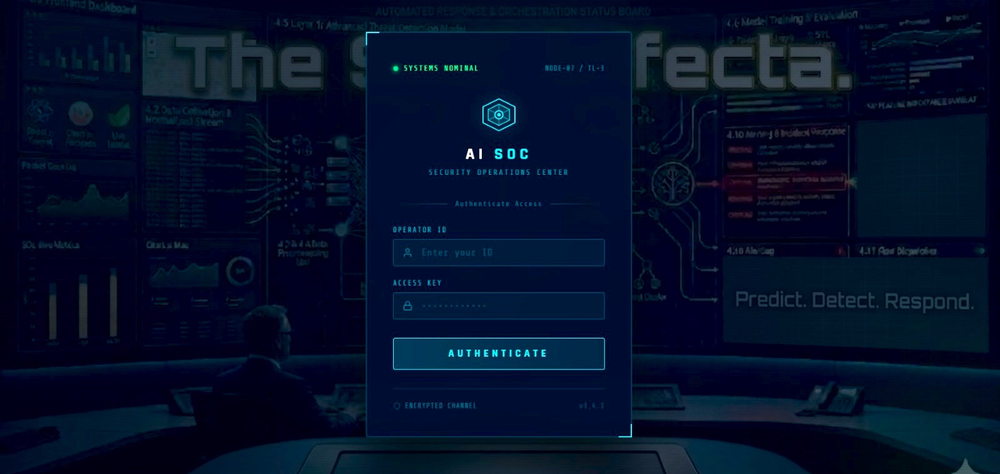
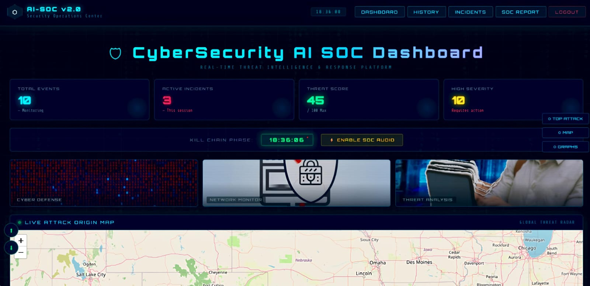
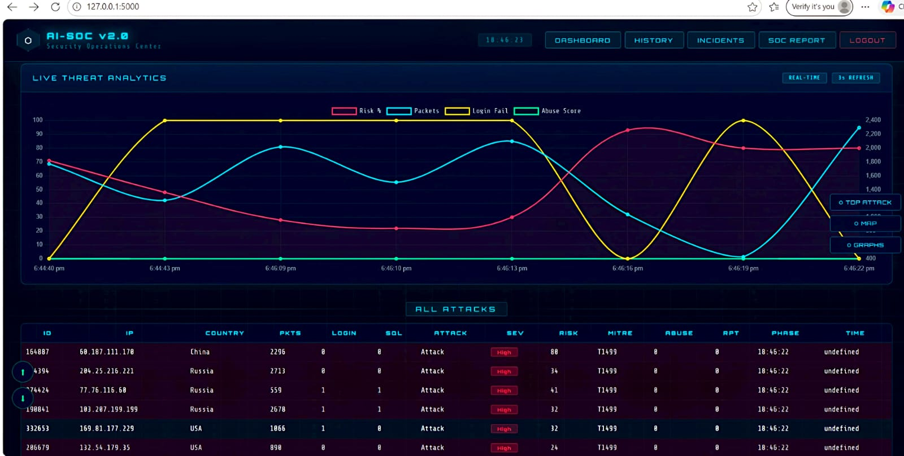
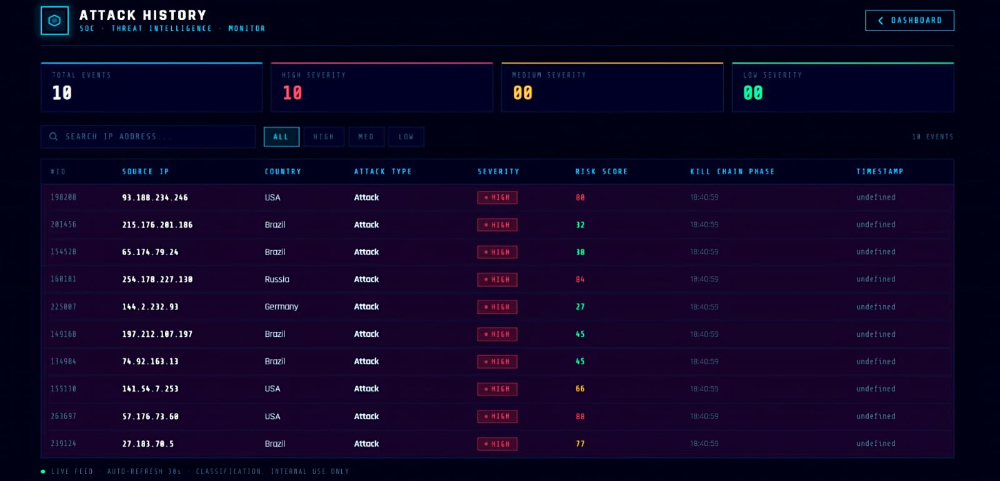
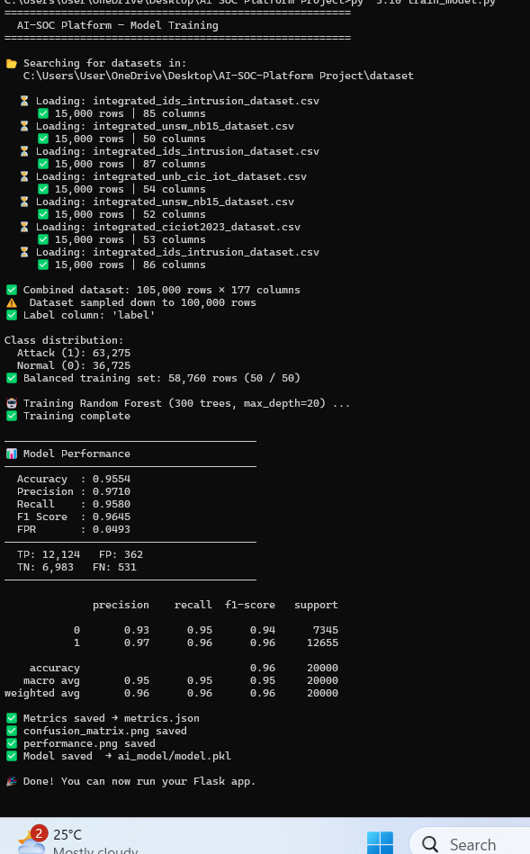

<div align="center">

```
███████╗ ██████╗  ██████╗    ██████╗ ██╗      █████╗ ████████╗███████╗ ██████╗ ██████╗ ███╗   ███╗
██╔════╝██╔═══██╗██╔════╝    ██╔══██╗██║     ██╔══██╗╚══██╔══╝██╔════╝██╔═══██╗██╔══██╗████╗ ████║
███████╗██║   ██║██║         ██████╔╝██║     ███████║   ██║   █████╗  ██║   ██║██████╔╝██╔████╔██║
╚════██║██║   ██║██║         ██╔═══╝ ██║     ██╔══██║   ██║   ██╔══╝  ██║   ██║██╔══██╗██║╚██╔╝██║
███████║╚██████╔╝╚██████╗    ██║     ███████╗██║  ██║   ██║   ██║     ╚██████╔╝██║  ██║██║ ╚═╝ ██║
╚══════╝ ╚═════╝  ╚═════╝    ╚═╝     ╚══════╝╚═╝  ╚═╝   ╚═╝   ╚═╝      ╚═════╝ ╚═╝  ╚═╝╚═╝     ╚═╝
```

### AI-Powered Security Operations Center


**[🔴 Live Demo](https://ai-soc-platform-7.onrender.com)**

</div>

---

## What This Is

A full-stack **Security Operations Center (SOC) simulation** that uses Machine Learning to detect cyber threats in real time. Built to mirror the workflows of real-world SOC teams — from ingestion and detection to incident management and executive reporting.

---

## Architecture

```
┌──────────┐    ┌───────────────┐    ┌───────────┐    ┌──────────────┐
│ Dataset  │───▶│ Preprocessing │───▶│ ML Model  │───▶│ Prediction   │
│ 5.7M rec │    │ 322 features  │    │ RF + 0.25 │    │     API      │
└──────────┘    └───────────────┘    └───────────┘    └──────┬───────┘
                                                             │
┌──────────┐    ┌───────────────┐    ┌───────────┐          │
│  Reports │◀───│   Dashboard   │◀───│ Database  │◀─────────┘
│ PDF/HTML │    │   Real-time   │    │  SQLite   │
└──────────┘    └───────────────┘    └───────────┘
```

---

## Performance at a Glance

| Metric | Score | What It Means |
|--------|-------|---------------|
| **Accuracy** | 93.5% | Overall correctness across all predictions |
| **Precision** | 93.6% | Of flagged attacks, 93.6% are real |
| **Recall** | 95.0% | Catches 95% of all actual attacks |
| **F1 Score** | 94.3% | Balanced precision-recall harmonic mean |

### Confusion Matrix

```
                  Predicted Normal    Predicted Attack
Actual Normal  │     TN: 7,090    │     FP:   661    │
Actual Attack  │     FN:   509    │     TP: 9,740    │
```

> **Design choice:** Threshold set to `0.25` with class weight `{0:1, 1:3}` to maximize recall.
> In a SOC environment, missing a real attack (FN) is far more dangerous than a false alarm (FP).

---

## Features

### 🛡️ AI Threat Detection
- Random Forest Classifier — binary classification (Normal / Attack)
- 322-feature extraction pipeline from raw network traffic
- Tunable confidence threshold for sensitivity control

### 📊 SOC Dashboard
- Real-time attack feed with severity tagging (Low / Medium / High)
- Risk scoring per event
- Simulated source IP & geolocation metadata

### 🚨 Incident Management
- Auto-created incidents on attack detection
- Analyst assignment & threaded comment system
- Status lifecycle: `Open → In Progress → Closed`

### 📄 Advanced Reporting
- Executive summary for non-technical stakeholders
- Full classification report with confusion matrix visual
- Detection metric breakdown: TP, TN, FP, FN, FPR

---

## ML Model Configuration

```python
RandomForestClassifier(
    n_estimators  = 300,
    max_depth     = 20,
    class_weight  = {0: 1, 1: 3},   # penalize missing attacks 3x
)

PREDICTION_THRESHOLD = 0.25          # lower threshold → higher recall
FEATURE_SIZE         = 322
```

---

## Datasets

| Dataset | Type |
|---------|------|
| CICIoT 2025 | IoT attack traffic |
| UNSW-NB15 | Network benchmark |
| IDS Intrusion | General intrusion |

Training used an optimized **~90,000 sample subset** from **~5.7 million** total records.

---

## Quickstart

```bash
# 1. Clone
git clone https://github.com/ManyaSohan/AI-SOC-Platform.git
cd AI-SOC-Platform

# 2. Install dependencies
pip install -r requirements.txt

# 3. Add your dataset
#    Place files inside the dataset/ directory

# 4. Train the model
py -3.10 train_model.py
#    Generates: model.pkl, metrics.json, confusion matrix & performance graphs

# 5. Run the application
py -3.10 app.py

# 6. Open in browser
#    http://127.0.0.1:5000/login
```

**Demo credentials**
```
Username: admin
Password: admin123
```
> ⚠️ Demo only. Use bcrypt or argon2 for production deployments.

---

## Project Structure

```
AI-SOC-Platform/
├── app.py                     # Flask application & routes
├── train_model.py             # Model training pipeline
├── requirements.txt
│
├── templates/
│   ├── login.html
│   ├── dashboard.html
│   ├── incidents.html
│   ├── history.html
│   └── report.html
│
├── static/
│   ├── confusion_matrix.png
│   └── performance.png
│
└── screenshots/
    ├── a.png                  # Login page
    ├── b.png                  # Dashboard
    ├── c.png                  # Graph view
    ├── d.png                  # Incidents
    ├── e.png                  # Terminal output
    ├── flow_diagram.png
    └── design_methodology.png
```

---

## Tech Stack

| Layer | Technology |
|-------|-----------|
| Backend | Flask (Python 3.10) |
| Frontend | HTML · CSS · JavaScript |
| Machine Learning | Scikit-learn |
| Database | SQLite |
| Visualization | Matplotlib · Seaborn |
| Deployment | Render |

---

## Screenshots

<details>
<summary><b>🔐 Login Page</b></summary>


</details>

<details>
<summary><b>🖥️ Dashboard</b></summary>


</details>

<details>
<summary><b>📊 Data / Graph View</b></summary>


</details>

<details>
<summary><b>🚨 Incidents / Logs</b></summary>


</details>

<details>
<summary><b>⚙️ Terminal / Backend Output</b></summary>


</details>

---

## Important Notes

The following files are excluded from this repo via `.gitignore` due to size:

```
dataset/       model.pkl      metrics.json
ai_model/      soc.db
```

Run `train_model.py` to regenerate all of these locally.

---

## Roadmap

- [ ] Real-time packet capture via Scapy / libpcap
- [ ] LSTM & Autoencoder models for anomaly detection
- [ ] Docker + cloud deployment (AWS / GCP)
- [ ] SIEM integration (Splunk / Elastic)
- [ ] Role-based access control for multi-analyst teams
- [ ] Alert confidence tiers to reduce analyst fatigue

---

## License

MIT License — see [LICENSE](LICENSE) for details.
