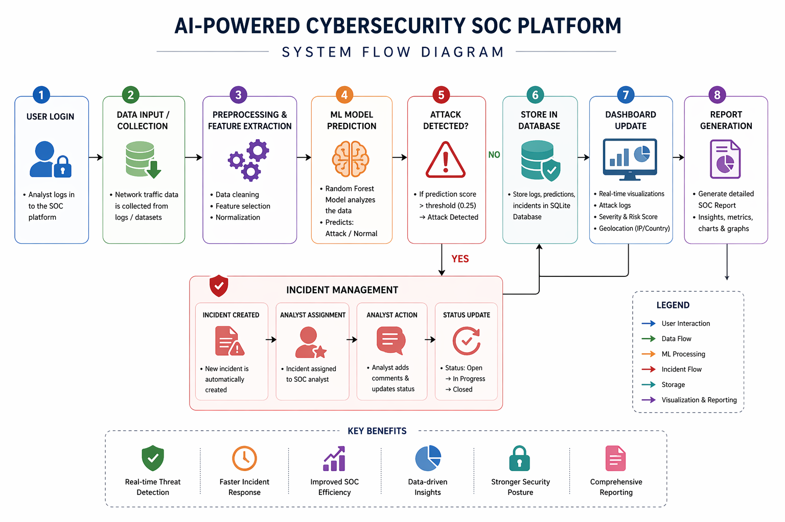
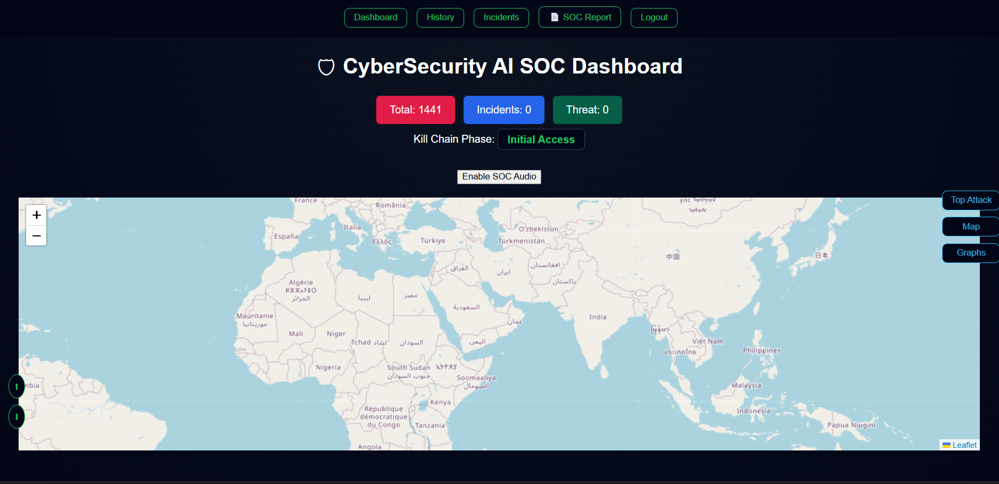
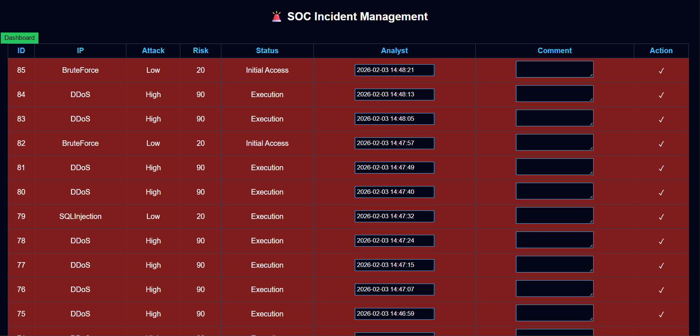
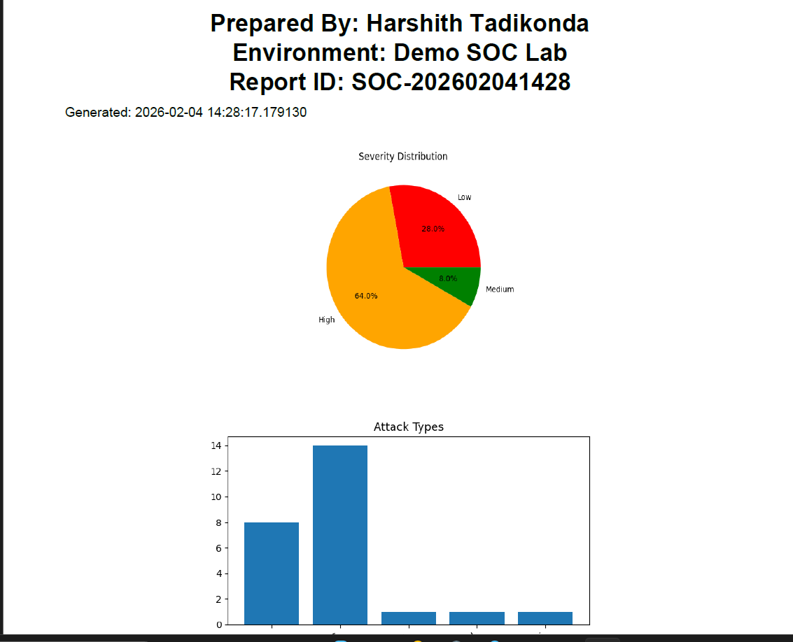

# 🚀 AI-Powered Cybersecurity SOC Platform

> A full-stack **Security Operations Center (SOC) simulation system** powered by Machine Learning for **real-time cyber threat detection, incident response, and security analytics**.

---

## 🔍 Overview

This project implements an **AI-driven intrusion detection system (IDS)** integrated with a **SOC dashboard** to simulate real-world cybersecurity operations.

It combines:

* Large-scale intrusion datasets (~5.7M records)
* Machine Learning (Random Forest)
* Flask-based web application
* Real-time monitoring & reporting

---

## 🧠 System Architecture

```
Dataset → Preprocessing → ML Model → Prediction API → Database → Dashboard → Reports
```

---

## ⚙️ Core Features

### 🔐 AI-Based Threat Detection

* Random Forest Classifier
* Binary classification: **Normal vs Attack**
* Threshold-based detection (0.25)

---

### 📊 SOC Dashboard

* Live attack logs
* Severity classification (Low / Medium / High)
* Risk scoring
* Simulated IP & country data

---

### 🚨 Incident Management

* Automatic incident creation
* Analyst assignment
* Comment system
* Incident status tracking (Open / Closed)

---

### 📄 Advanced SOC Report

Includes:

* Executive Summary
* Attack Insights
* Dataset Statistics
* Model Performance Metrics
* Classification Report
* Confusion Matrix Visualization
* Detection Metrics (FP, FN, TP, TN, FPR)

---

## 🤖 Machine Learning Model

* **Algorithm:** Random Forest Classifier

* **Hyperparameters:**

  * `n_estimators = 300`
  * `max_depth = 20`
  * `class_weight = {0:1, 1:3}`

* **Feature Size:** 322 features

* **Prediction Threshold:** 0.25

---

## 📊 Model Performance

| Metric    | Value  |
| --------- | ------ |
| Accuracy  | ~93.5% |
| Precision | ~93.6% |
| Recall    | ~95.0% |
| F1 Score  | ~94.3% |

---

### 🧪 Confusion Matrix

```
TN: 7090
FP: 661
FN: 509
TP: 9740
```

---

### 📉 Detection Metrics

* False Positive Rate (FPR)
* False Negatives minimized (critical for SOC environments)
* High Recall ensures maximum attack detection

---

## 📊 Dataset Information

* CICIoT Dataset (Latest / 2025)
* UNSW-NB15 Dataset
* IDS Intrusion datasets

👉 Total dataset size: **~5.7 million records**
👉 Used for training: **~90,000 samples (optimized subset)**

---

## ⚠️ Dataset & Model Note

Due to GitHub file size limitations, the following are **not included** in this repository:

* `dataset/`
* `ai_model/`
* `model.pkl`
* `metrics.json`
* `soc.db`

These files are excluded using `.gitignore` to keep the repository lightweight and maintainable.

### 🧠 Reproducing Results

To regenerate the model and metrics:

```bash
py -3.10 train_model.py
```

This will generate:

* `model.pkl`
* `metrics.json`
* Confusion matrix and performance graphs

---

## 🔄 System Flow Diagram



### Flow Explanation

1. User logs into the SOC platform
2. Network/activity data is captured
3. Features are extracted and processed
4. ML model predicts **Attack / Normal**
5. If attack detected → Incident created
6. Data stored in database
7. Dashboard updates in real-time
8. Reports generated with analytics

---

## 🔐 Authentication System

* Login-based authentication
* Session handling using Flask
* Protected routes (Dashboard, Incidents, Reports)

### Demo Credentials

```
Username: admin  
Password: admin123  
```

> ⚠️ Demo only. Production systems should use secure password hashing.

---

## 📥 Clone & Run the Project

### 1️⃣ Clone Repository

```bash
git clone https://github.com/ManyaSohan/AI-SOC-Platform.git
cd AI-SOC-Platform
```

---

### 2️⃣ Install Dependencies

```bash
pip install -r requirements.txt
```

---

### 3️⃣ Add Dataset

Place dataset inside:

```
dataset/
```

---

### 4️⃣ Train Model

```bash
py -3.10 train_model.py
```

---

### 5️⃣ Run Application

```bash
py -3.10 app.py
```

---

### 6️⃣ Open in Browser

```
http://127.0.0.1:5000/login
```

---

## 📁 Project Structure

```
AI-SOC-Platform/
│
├── static/
│   ├── confusion_matrix.png
│   └── performance.png
│
├── templates/
│   ├── dashboard.html
│   ├── history.html
│   ├── incidents.html
│   ├── login.html
│   └── report.html
│
├── screenshots/
│   ├── dashboard.png
│   ├── incidents.png
│   ├── report.png
│   └── flow_diagram.png
│
├── app.py
├── train_model.py
├── requirements.txt
└── README.md
```

---

## 📈 Visualization

* Confusion Matrix
* Model Performance Graph
* SOC Report Analytics

---

## 🚀 Technologies Used

* **Backend:** Flask (Python)
* **Frontend:** HTML, CSS, JavaScript
* **Machine Learning:** Scikit-learn
* **Database:** SQLite
* **Visualization:** Matplotlib, Seaborn

---

## ⚠️ Design Considerations

* Dataset sampling for performance optimization
* Threshold tuning for improved recall
* JSON-safe metric storage
* Feature size consistency (322 features)

---

## 🔮 Future Enhancements

* Real-time network packet capture
* Deep learning models (LSTM, Autoencoder)
* Cloud deployment (AWS / Docker)
* Live SOC dashboards
* SIEM integration

---

## 📸 Screenshots

### Dashboard



### Incidents



### Report



---
